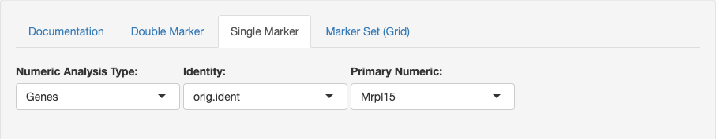
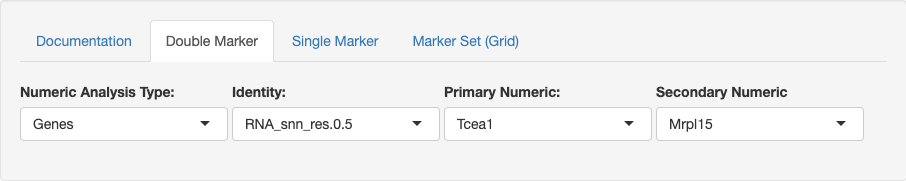
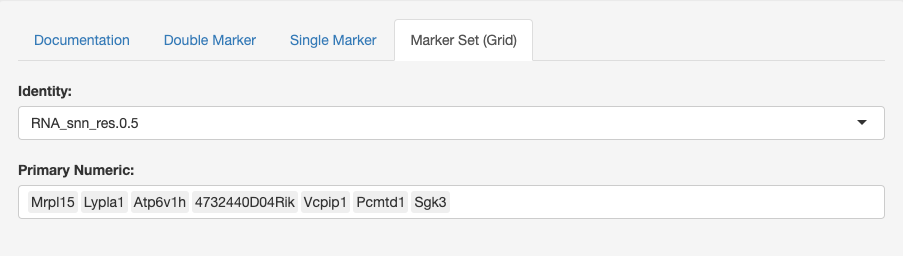

# scRNA-seq analysis application
---
# Dataset Information:
- Dataset name: 
- Owner: 
- Sharing with 1 user(s) and 1 group(s) 
- Description: 
- File size: 

---
Shiny App Tutorial
---

### Single Marker View:
Explore a single feature (gene, metadata, etc.) and its relation to variations of clustering or on a per sample basis. 

#### Options: 

- Numeric Analysis Type: [Genes, Numeric Metadata, PCs]
    - Genes: Are you interested in looking at genes or interest such as marker genes?
    - Numeric Metadata: Are you interested in looking at metadata features such as: 
        - percent mitochondria expression for each cell’s expression (percent.mito)
        - number of total unique genes or ‘features’ expressed (nFeature_RNA)
        - Total number of genes expressed or total count of RNA (nCount_RNA)
    - PCs: Are you interested in exploring the principal components that contribute to the tSNE plot seen?
- Identity: 
    - Orig.ident: This will color the graph based on the names of the samples processed. 
    - RNA_snn_res.0.XX: This will color the graph based on groupings produced by Seurat as various resolutions.
        - A higher value of XX means that there is a higher resolution, and therefore more clusters or inferred groups of cell types. 
        - A lower value of XX means that there is a 
- Primary Numeric: This will change to be Genes, Numeric Metadata, or PCs based on the value selected for ‘Numeric Analysis Type’.

#### Graphs:
- The first plot is a tSNE that is colored based on the Primary Numeric selection. 
- The second plot is a violin plot that displays the Identity selection on the X-axis and the Primary Numeric on the Y-axis. 
- The third plot is the tSNE that is colored based on the Identity selection. 

Having trouble understanding what a tSNE plot represents?
- tSNE helpful video: https://www.youtube.com/watch?v=NEaUSP4YerM

---
### Double Marker View:
Explore two features (gene, metadata, etc.) and its relation to variations of clustering or on a per sample basis. 

#### Options: All of the options here are the same as the Single Marker View with the following field as an option.
 
- Secondary Numeric: This, in combination with the Primary Numeric field enables a user to explore two Genes, Numeric Metadata, or PCs based on the value selected for ‘Numeric Analysis Type’.

#### Graphs:
- The first plot is a tSNE that is colored based on the Primary Numeric and Secondary Numeric selection. 
- The second plot’s first tile is a violin plot that displays the Identity selection on the X-axis and the Primary Numeric on the Y-axis. The second plot’s second tile is the same as the first tile but is based on the selection of the Secondary Numeric field. 
- The third plot is the tSNE that is colored based on the Identity selection. 

Having trouble understanding what a tSNE plot represents?
- tSNE helpful video: https://www.youtube.com/watch?v=NEaUSP4YerM

---
### Marker Set (Grid)
This plot helps to explore sets of genes and their relation to the identity. 

#### Options:

- Identity: the same as what is described for the Single Marker View
- Gene Selection: here you choose the set of genes you would like to explore based on the Identity selected. 

#### Graph:
- Y-axis represents the Identity, such as the original samples or some groupings at a certain resolution.
- X-axis represents the genes selected. (Primary Numeric) 
- The size of each dot on the grid represents the percentage of cells that expressed that gene. 
- The color intensity of each dot on the grid represents the average expression of the cells that expressed a given gene. 
- So what makes for a good marker gene for some given identity?
    - High mean expression
    - High percentage of cells expressing the gene
    - Low mean expression and percentage of cells expressing the gene for the rest of the identities