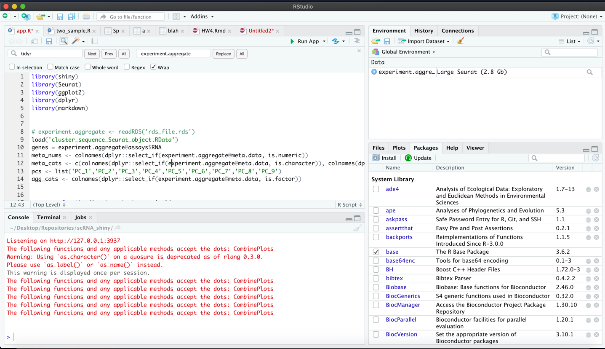
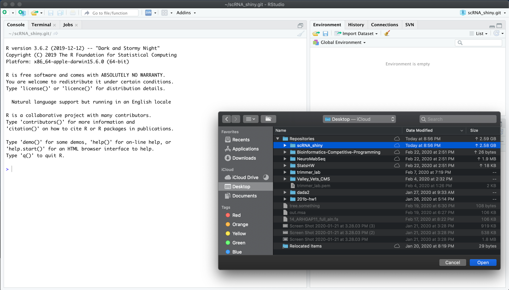
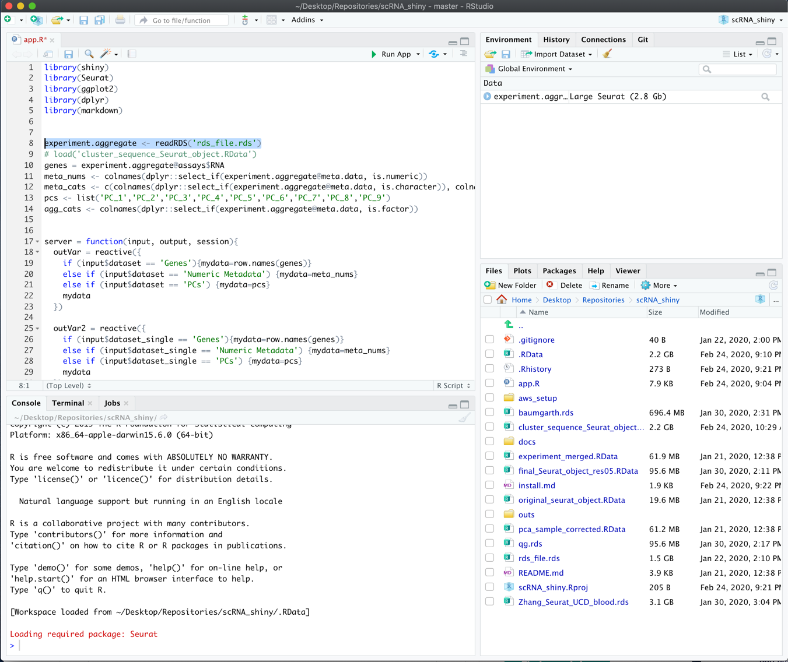
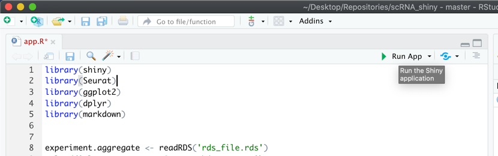

# Installing and running the app:

1. Install Rstudio for your operating system. 

    https://rstudio.com/products/rstudio/download/#download

2. Install R version 4.0.0
    - windows: https://cran.r-project.org/bin/windows/base/
    - macosx: https://cran.r-project.org/bin/macosx/R-4.0.0.pkg
    - linux: `sudo apt install r-base`

3. Open RStudio and point it to the newest version of R (only applicable if you have an old version of R installed)

4. Install the following packages by running these lines in your R console:
    (shown in the image in the bottom left hand corner)
    

    ```
    if (!any(rownames(installed.packages()) == "shiny")){
      install.packages("shiny")
    }
    library(shiny)
    
    if (!any(rownames(installed.packages()) == "markdown")){
      install.packages("markdown")
    }
    library(markdown)
    
    if (!any(rownames(installed.packages()) == "tidyr")){
      install.packages("tidyr")
    }
    library(tidyr)

    if (!any(rownames(installed.packages()) == "ggplot2")){
      if (!requireNamespace("BiocManager", quietly = TRUE))
          install.packages("BiocManager")
      BiocManager::install("ggplot2")
    }
    library(ggplot2)
    
    if (!any(rownames(installed.packages()) == "dplyr")){
      if (!requireNamespace("BiocManager", quietly = TRUE))
          install.packages("BiocManager")
      BiocManager::install("dplyr")
    }
    library(dplyr)
    
    
    if (!any(rownames(installed.packages()) == "Seurat")){
      if (!requireNamespace("BiocManager", quietly = TRUE))
          install.packages("BiocManager")
      BiocManager::install("Seurat")
    }
    library(Seurat)
    ```

5. Download the contents of the app: https://github.com/ucdavis-bioinformatics/scRNA_shiny/archive/master.zip
    - move it somewhere convenient like your Desktop
    
6. File > Open project in Rstudio. Then choose wherever you moved this folder. 


7. Move the file of interest (.rds) supplied to you to this same directory (likely from bioshare). Then change the highligted line to be the name of the your file.

(finally click run app at the top of the page after clicking on the app.R file of the right hand side of the GUI)
